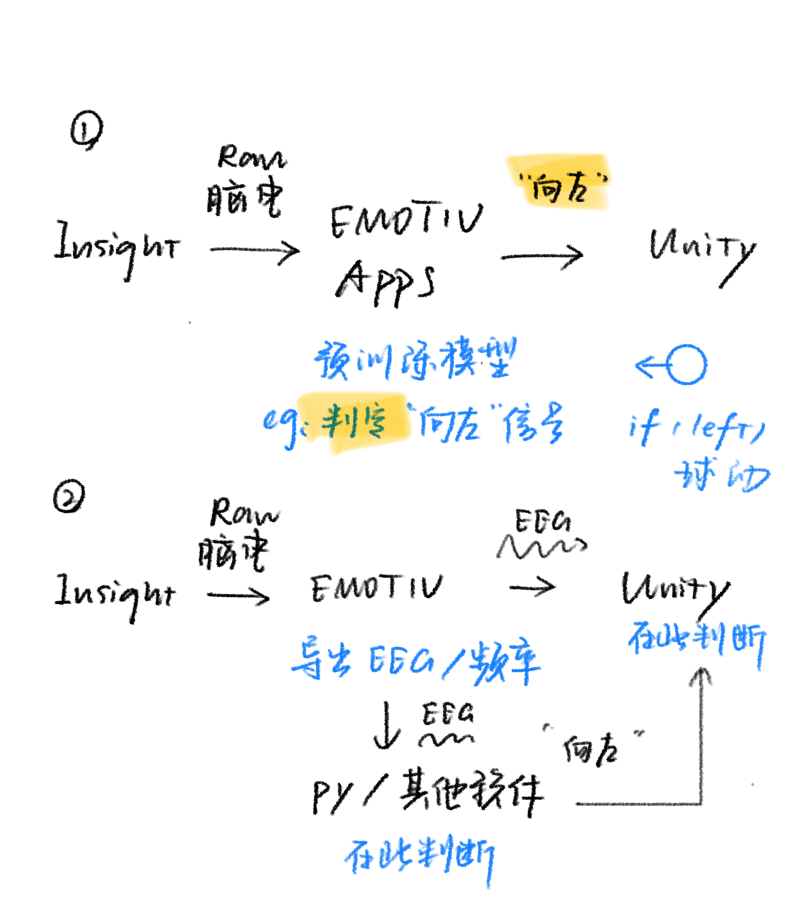
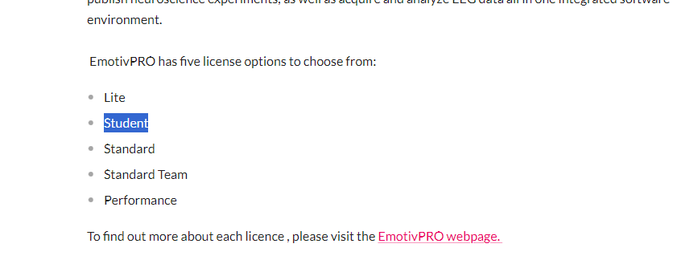
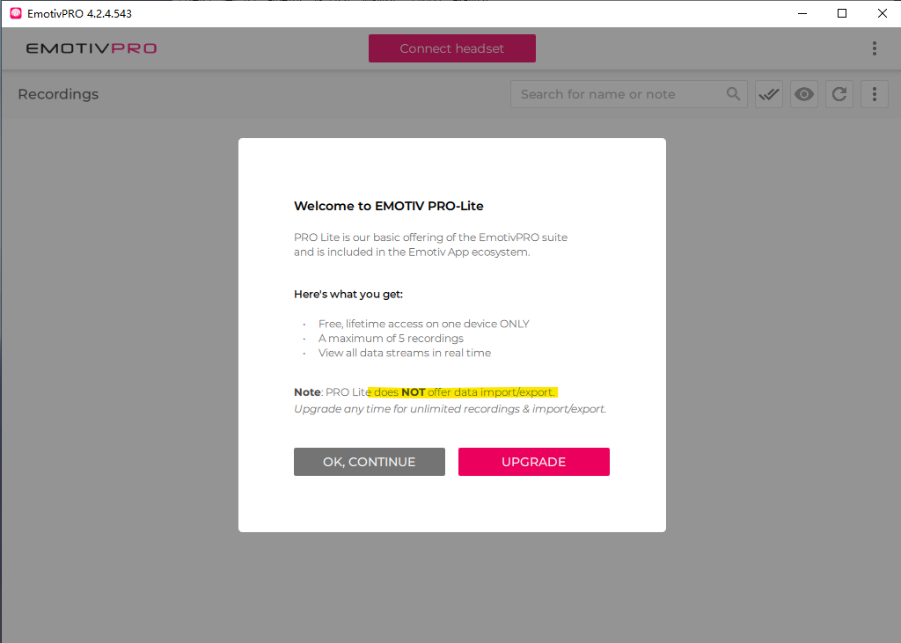
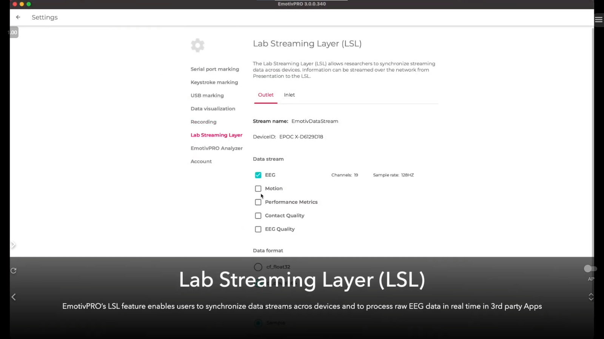

# 0 设想

让Unity/多媒体内的物件，随着脑电的波动变化。

eg：运行中使用意念控制球向左走

下面根据此，调查几种实现方案

# 1 EmotivBCI-OSC

99刀一年

https://www.emotiv.com/products/bci-osc#buy

>  BCI-OSC is a new addition to EMOTIV’s flagship BCI product, built for Insight, EPOC X and EPOC+. It allows you to train a profile, send mental commands, facial expressions, or performance metrics to an external, network-connected device.
> BCI-OSC 是 EMOTIV 旗舰 BCI 产品的新成员，专为 Insight、EPOC X 和 EPOC+ 而构建。它允许您训练配置文件、将心理命令、面部表情或性能指标发送到外部网络连接设备。 
>
> Open Sound Control (OSC) is a universal communications protocol optimized for modern networking to enable connections between computers and other multimedia devices. EMOTIV’s BCI-OSC enables EMOTIV Brainwear® and Virtual Brainwear® to interface with a wider variety of OSC compatible hardware and software applications.
> 开放式声音控制 （OSC） 是一种通用通信协议，针对现代网络进行了优化，以实现计算机和其他多媒体设备之间的连接。EMOTIV 的 BCI-OSC 使 EMOTIV Brainwear® 和 Virtual Brainwear® 能够与更广泛的 OSC 兼容硬件和软件应用程序进行交互。 

### Github

Emotiv Open Sound Control (OSC)

https://github.com/Emotiv/opensoundcontrol 重点看！

eg：

数据结构：E:\Unity\Emotiv\opensoundcontrol\README.md

python E:\Unity\Emotiv\opensoundcontrol\examples\python\EmotivOSCPython.py

# 2 PRO

https://www.emotiv.com/products/emotivpro#shopify-section-template--22661813141823__4e924ec7-ee05-45bc-8302-dac3183e8700

### 2.1 定价

年度计划的月平均价格，可以忽略

**月度 最低149刀**

学生优惠，手册里有提到，但是跳转到上图是找不到的，需要的话可以后续发邮件细文

### 2.2 What Does EmotivPRO Software Include?

https://www.emotiv.com/tools/knowledge-base/emotivpro/what-does-emotivpro-software-include

意思是升级才能使用导出功能

#### 2.21关于LSL

>  Lab Streaming Layer (LSL) is a protocol that enables streamlined and synchronized collection of time series measurements across multiple machines and applications. The LSL feature is designed to support research experiments requiring sub-millisecond timing precision and to allow efficient, two-way communication between EmotivPRO and other third party software and devices. EmotivPRO’s LSL feature allows users to synchronize data streams across multiple devices and allows real- time processing of raw EEG data in 3rd party Apps. LSL also makes it possible to send distinct markers on different computing devices and synchronize markers across the devices and applications. Here are guidelines and some examples to use LSL with EMOTIV Brainwear®.
> 实验室流层 （LSL） 是一种协议，可跨多台计算机和应用程序简化和同步收集时间序列测量值。LSL功能旨在支持需要亚毫秒级定时精度的研究实验，并允许**EmotivPRO与其他第三方软件和设备之间进行高效的双向通信。**EmotivPRO的LSL功能允许用户在**多个设备之间同步数据流**，并允许**在第三方应用程序中实时处理原始EEG数据**。 LSL还可以在不同的计算设备上发送不同的标记，并在设备和应用程序之间同步标记。以下是将 LSL 与 EMOTIV Brainwear® 一起使用的指南和一些示例。 

##### 1 Data Output format 数据输出格式

很多种，其中 **Performance-Metrics**是可以参考使用的。

基础的EEG也可以用于制作粒子、声音等表现效果。

> The data output format as below table:
> 数据输出格式如下表所示：

| Stream type 流类型      | Data output format 数据输出格式                              | Sample rate 采样率                                           | Notes                                                        |
| ----------------------- | ------------------------------------------------------------ | ------------------------------------------------------------ | ------------------------------------------------------------ |
| EEG                     | {"Timestamp", "Counter", "Interpolate", , "HardwareMarker", "Markers" } {“Timestamp”， “计数器”， “Interpolate”， ， “HardwareMarker”， “标记” } | 128Hz/ 256 Hz 128赫兹/ 256赫兹                               | Description of EEG channels at [link](https://emotiv.gitbook.io/cortex-api/data-subscription/data-sample-object#eeg). The Markers channel is supported from V3.0 and it is marker value of marker object included on EEG data. 链接处的脑电图通道描述。从 V3.0 开始支持标记通道，它是 EEG 数据中包含的标记对象的标记值。 |
| Motion                  | {"Timestamp", "Counter", "Interpolate", "Q0","Q1","Q2","Q3", "ACCX","ACCY","ACCZ", "MAGX","MAGY","MAGZ"} {“时间戳”， “计数器”， “插值”， “Q0”，“Q1”，“Q2”，“Q3”， “ACCX”，“ACCY”，“ACCZ”， “MAGX”，“MAGY”，“MAGZ”} | 32 Hz / 64 Hz / 128 Hz 32赫兹 / 64赫兹 / 128赫兹             | Description of Motion channels at [link](https://emotiv.gitbook.io/cortex-api/data-subscription/data-sample-object#motion) 链接中的运动通道的描述 |
| **Performance-Metrics** | {"Timestamp", "Engagement","Excitement","Focus","Interest ", "Relaxation","Stress"} {“时间戳”， “参与”，“兴奋”，“专注”，“兴趣”， “放松”，“压力”} | 2 Hz for high resolution / 0.1 Hz for low resolution 高分辨率为 2 Hz，低分辨率为 0.1 Hz | Description of Performance metric at [link](https://emotiv.gitbook.io/cortex-api/data-subscription/data-sample-object#performance-metric) 链接处的性能指标说明 |
| Contact-Quality         | {"Timestamp", "BatteryPercent", "Overall", "Signal", } {“时间戳”， “电池百分比”， “总体”， “信号”， } | 2 Hz 2赫兹                                                   | Description of Contact Quality at [link](https://emotiv.gitbook.io/cortex-api/data-subscription/data-sample-object#device-information) but the order of channels changes a bit. 链接处的联系人质量描述，但通道顺序略有变化。 |
| EEG-Quality             | {"Timestamp","BatteryPercent","Overall","SampleRateQuality", } {“Timestamp”，“BatteryPercent”，“Overall”，“SampleRateQuality”， } | 2 Hz 2赫兹                                                   | Description of EEG Quality at [link](https://emotiv.gitbook.io/cortex-api/data-subscription/data-sample-object#eeg-quality) EEG Quality at link的描述 |
| Band-Power              | {"Timestamp",<EEG sensors/Band>} {“时间戳”，<EEG传感器/波段>} | 8 Hz 8赫兹                                                   | Description of Band Power at [link](https://emotiv.gitbook.io/cortex-api/data-subscription/data-sample-object#band-power) Band Power at link的描述 |

##### 2 手册

手册：

https://emotiv.gitbook.io/emotivpro-v3/lab-streaming-layer-lsl/about 

Emotiv Lab 流层界面 github：

https://github.com/Emotiv/labstreaminglayer   **重点看**

 Unity 使用 EMOTIV LSL 接口的指南 ：

https://github.com/Emotiv/labstreaminglayer/blob/master/examples/unity/readme.md

支持双向。

- 在Unity中从EMOTIV LSL Outlet流接收数据 
  - 可以用
- 将标记从Unity发送到EMOTIV LSL Inlet 
  - 多为神经科学实验使用

#### 2.22 导出功能

https://emotiv.gitbook.io/emotivpro-v3/managing-your-eeg-data-recordings/exporting-an-eeg-data-recording

>  A window will open on the screen with different data export options. Select or unselect additional data streams you want to export (EEG data is always exported), choose a folder to export the EEG data recording to, and choose whether you want your data exported as a CSV or EDF file. 
> 屏幕上将打开一个窗口，其中包含不同的数据导出选项。选择或取消选择要导出的其他数据流（始终导出脑电图数据），选择要将脑电图数据记录导出到的文件夹，并选择是要**将数据导出为 CSV 还是 EDF 文件。** 

皆是静态文件

# 3 Insight2OSC

论坛里找到一个免费的Insight的OSC仓库，有人用来做音乐，他认为效果有缺陷。

https://forum.emotiv.com/search/education/

# 4 API

My project is an interactive art exhibition centered on Zen, using EEG technology and VR to transform participants' focus into immersive experiences.

https://www.emotiv.com/products/emotivpro#cortex-api

已经发送，12h内官方将回复

# 5 网址

论坛：https://forum.emotiv.com/